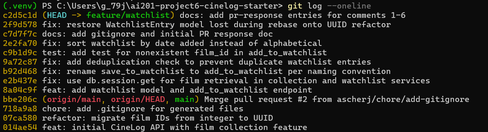

# PR Response Doc — CineLog Watchlist Feature

## AI Usage

I used Claude during this project in a few specific ways:

- **Understanding existing code patterns:** For Comments 1–3 (rename, deduplication, and missing test), I used AI to help me follow the existing `add_to_collection()` pattern. I used it as a reference for matching the existing exception handling, query style, and test structure already used in `test_collection.py`.

- **Reviewing design decisions (Comments 4 and 5):** I wrote my own initial thoughts on default visibility and sorting, then used AI to challenge my reasoning and point out possible reviewer concerns. For Comment 4, this helped me realize that I was making an assumption about users preferring discovery without enough reasoning behind it. I also noticed I needed to explain the difference between a watchlist (future viewing plans) and a collection (movies already watched), since a watchlist could feel more private. I updated my response to address that. For Comment 5, my original reasoning still made sense after review, so I kept my original position.

- **Git/rebase troubleshooting:** I used AI while resolving the `.gitignore` conflict during the rebase and while debugging an `ImportError` after rebasing. The issue ended up being that the `WatchlistEntry` model was removed during the automatic merge. AI helped me use `git reflog` and `git show` to recover the original model instead of recreating it from memory.

- **Commit message formatting:** I used AI to help convert my commits into conventional commit format (`feat:`, `fix:`, `test:`, `docs:`) during the interactive rebase in Milestone 4.

All code changes were written and tested by me. AI was not used to write my arguments for Comments 4 and 5. I only used it to review my reasoning and point out possible weaknesses in my drafts.

## Comment 1 — Rename

**What I did:** Renamed `save_to_watchlist()` to `add_to_watchlist()` in `services/watchlist_service.py`, updated the docstring, and changed the one usage in `routes/watchlist/watchlist.py`.

**How I verified:** I ran:

`Get-ChildItem -Recurse -Filter *.py | Select-String -Pattern "save_to_watchlist"`

to confirm there were no remaining references. I then ran `pytest tests/ -v` and all 4 tests passed.

## Comment 2 — Deduplication

**What I did:** Added an `AlreadyInWatchlistError` exception and added duplicate checking inside `add_to_watchlist()`. I followed the same approach as `add_to_collection()` by checking whether a `WatchlistEntry` already exists with the same `user_id` and `film_id` before creating a new entry. If one exists, the function raises an error.

**How I verified:** Ran `pytest tests/ -v` and all 4 existing tests passed. I also kept this change separate from the rename commit as requested.

## Comment 3 — Missing test

**What I did:** Added `tests/test_watchlist.py` with a new test called `test_add_to_watchlist_nonexistent_film_raises`. I followed the same structure as `test_add_to_collection_nonexistent_film_raises`, including the same fixtures (`app`, `sample_user`, `sample_film`), fake UUID format, and `pytest.raises` assertion.

**How I verified:** Ran `pytest tests/test_watchlist.py -v` and the test passed. I also ran the full test suite with `pytest tests/ -v` to make sure there were no regressions.

## Comment 4 — Default visibility

**My position:** Watchlists should default to `public=True`.

**Reasoning:** I chose this because CineLog can benefit from users being able to discover movies through other people's watchlists. Even though CineLog is mainly a movie tracking app and not a social platform, public watchlists make it easier for users to share recommendations and see what others are planning to watch without needing to change settings first.

**Tradeoff acknowledged:** The downside is that watchlists can reveal a user's future viewing interests, which some users may consider more private than their watched history. Those users would need to manually change their visibility settings. I think this tradeoff is reasonable because my decision prioritizes discovery and sharing, but I understand that `public=False` would provide more privacy by default.

**AI usage note:** I used AI to review my draft and identify possible counterarguments. It pointed out that I was assuming users wanted discovery without explaining why, and that I needed to better explain why a watchlist could be more private than a collection. I revised my response to address those points.

## Comment 5 — Sort order

**My position:** I agree with changing the default sort order to date added.

**Reasoning:** A watchlist is usually used to keep track of movies someone wants to watch in the future. Showing recently added movies first makes it easier for users to find the films they just discovered or saved. Alphabetical sorting is organized, but it does not match how users typically add and interact with a watchlist.

**Engagement with reviewer's point:** I agree with the maintainer's point that many users will want to see what they recently added. Since watchlists change as users discover new movies, sorting by date added better matches everyday usage. Alphabetical sorting could still be useful as an optional sorting choice, but I think date added works better as the default.

## Comment 6 — Rebase

**What conflicted:** Running `git rebase origin/main` caused an add/add conflict in `.gitignore` because both branches had different versions of the file. I combined both versions into one `.gitignore` file that included all necessary entries.

After resolving that conflict, the rebase completed, but running tests caused an `ImportError: cannot import name 'WatchlistEntry' from 'models'`. The UUID changes from main had replaced parts of `models.py`, which caused my `WatchlistEntry` model to disappear during the rebase without creating a visible conflict.

**How I resolved it:** I used `git reflog` and `git show ec90edb:models.py` to recover the original `WatchlistEntry` model from before the rebase. I added it back into the updated `models.py` and changed `film_id` from `db.Integer` to `db.String(36)` so it matched the UUID changes already made elsewhere. I also updated outdated docstrings in `watchlist_service.py` that still referred to integer film IDs.

**How I verified everything was fixed:** I ran `pytest tests/ -v` and all 5 tests passed, including the new watchlist test. I also checked `git log --oneline` to confirm the branch history was linear and cleanly rebased on top of `origin/main`.

## PR Description

### What this feature does

This PR adds a watchlist feature to CineLog. Users can now save movies they want to watch in the future, separate from their collection which tracks movies they have already watched.

This feature includes:

- A `WatchlistEntry` model with `user_id`, `film_id`, `date_added`, and `public` fields
- `add_to_watchlist(user_id, film_id)` and `get_watchlist(user_id)` service functions
- REST endpoints:
  - `GET /watchlist/<user_id>`
  - `POST /watchlist/<user_id>/add`
- Duplicate checking to prevent the same movie from being added multiple times
- A test for handling nonexistent film IDs using the same pattern as the collection service tests

### Design decisions

**Default visibility (`public=True`):**  
Watchlists default to public to support movie discovery and sharing. This allows users to see what others are planning to watch without additional setup. The tradeoff is that users who want their future viewing plans to stay private will need to change the visibility setting. See Comment 4 for more details.

**Sort order (`date_added`, newest first):**  
`get_watchlist()` sorts movies by `date_added` in descending order instead of alphabetically. Since a watchlist represents movies a user wants to watch next, recent additions are usually more relevant than alphabetical order. See Comment 5 for more details.

### How to manually test
1. Start the app: `python app.py`
2. Create a user and a film in the database (via existing collection endpoints, Python shell, or seed script).
3. Add a film to the watchlist — expect a `201` response with the new entry:

```bash
curl -X POST http://127.0.0.1:5000/watchlist/<user_id>/add \
  -H "Content-Type: application/json" \
  -d '{"film_id": "<film_id>"}'
```

4. Attempt to add the same film again — expect an error (duplicate prevention).
5. Attempt to add a nonexistent `film_id` — expect a `404`/error response (film not found).
6. View the watchlist — confirm films are returned newest-added first:

```bash
curl http://127.0.0.1:5000/watchlist/<user_id>
```

7. Run the automated test suite: `pytest tests/ -v` — all 5 tests should pass.

## git log --oneline Screenshot
